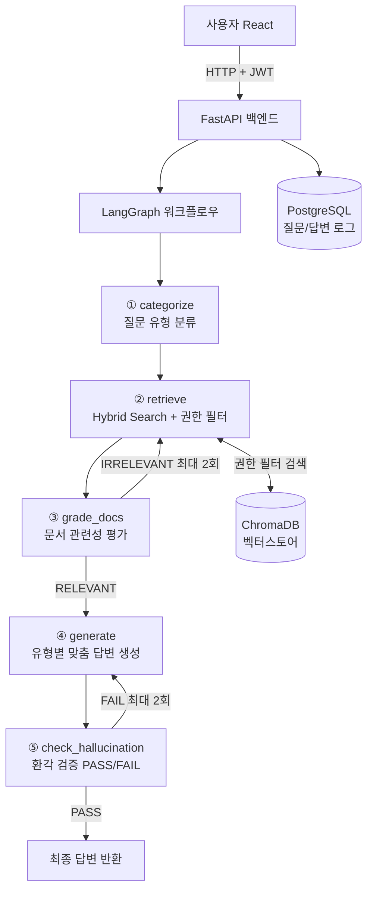

<div align="center">

# 🔐 기업 IT 보안 정책 AI 어시스턴트
### ISMS-P 문서 기반 Self-Correction RAG 시스템

**"단순히 RAG를 만든 것이 아니라, 답변의 환각(Hallucination)을 줄이기 위해 이중 검증 루프를 설계했습니다."**

[](https://fastapi.tiangolo.com)
[](https://langchain-ai.github.io/langgraph/)
[](https://www.trychroma.com)
[](https://react.dev)
[](https://www.postgresql.org)
[](https://aws.amazon.com)
[](https://www.docker.com)

### 🌐 [AWS EC2 배포 환경에서 실제 서비스 체험하기 →](http://3.26.94.252/)
`employee / employee` · `sq / sq` · `admin1 / admin1`

</div>

---

## 📸 서비스 화면

<table>
  <tr>
    <td align="center" width="50%">
      
      <br/><sub><b>JWT 기반 로그인</b></sub>
    </td>
    <td align="center" width="50%">
      
      <br/><sub><b>ADMIN 전용 로그 분석 대시보드</b></sub>
    </td>
  </tr>
  <tr>
    <td align="center" width="50%">
      
      <br/><sub><b>ACTION 유형 — 단계별 절차 답변</b></sub>
    </td>
    <td align="center" width="50%">
      
      <br/><sub><b>SECURITY 권한 — 다중 문서 출처 표시</b></sub>
    </td>
  </tr>
  <tr>
    <td align="center" width="50%">
      
      <br/><sub><b>범위 외 질문 — 출처 없으면 답변 거부</b></sub>
    </td>
    <td align="center"></td>
  </tr>
</table>


---

## 🎯 핵심 차별화 포인트

| | 일반 RAG | **이 프로젝트** |
|---|---|---|
| **검색 방식** | 벡터 검색만 사용 | 벡터 + BM25 **Hybrid Search** |
| **검색 품질** | 결과 그대로 사용 | 문서 관련성 LLM 평가 후 **재검색** (최대 2회) |
| **답변 생성** | 1회 생성 후 반환 | 환각 검증(PASS/FAIL) 후 **자동 재생성** (최대 2회) |
| **출처 처리** | 출처 표시만 | 출처 없으면 **답변 자체 차단** |
| **접근 제어** | 없음 | **EMPLOYEE / SECURITY / ADMIN** 3단계 권한별 문서 분리 |
| **운영 관리** | 없음 | ADMIN 전용 **로그 분석 대시보드** |

---

## 🏗️ 시스템 아키텍처



---

## ⚙️ 기술 스택

| 기술 | 선택 이유 |
|------|-----------|
| **LangGraph** | 검증 → 재시도 순환 루프를 그래프 구조로 명확하게 표현 |
| **ChromaDB + BM25** | 의미 검색(벡터) + 정확 검색(키워드) 병행으로 검색 누락 최소화 |
| **text-embedding-3-small** | 비용 효율적이면서 한국어 문서 처리 성능 검증 |
| **FastAPI** | 비동기 처리 + 자동 Swagger 문서 + Pydantic 타입 안전성 |
| **PostgreSQL** | 정형 로그 저장 및 대시보드 집계 쿼리 최적화 |
| **JWT (HS256)** | Stateless 토큰으로 권한(role) 정보 내장, 서버 세션 불필요 |
| **AWS EC2 + Docker** | 로컬-서버 환경 차이 제거(컨테이너화) + 클라우드 배포 일관성 |

---

## 🔑 핵심 구현 — Hybrid Search + Query Rewriting

일반 RAG와 가장 차별화되는 부분입니다. 벡터 검색과 BM25 키워드 검색을 병행하고, 권한 필터를 적용한 뒤 중복을 제거합니다. 재검색 시에는 LLM이 질문을 키워드 중심으로 자동 재작성(Query Rewriting)하여 검색 다양성을 확보합니다.

```python
# 권한 레벨에 따라 접근 가능한 문서 필터 동적 생성
accessible = [r for r, l in ROLE_LEVELS.items() if l <= user_level]
filter_dict = {"$or": [{"permission": p} for p in accessible]}

# 벡터 검색 + BM25 병행 후 중복 제거
vector_docs = vectorstore.similarity_search(question, k=k, filter=filter_dict)
bm25_docs   = bm25_retriever.invoke(question)

seen, combined = set(), []
for doc in vector_docs + bm25_docs:
    if doc.page_content not in seen:
        seen.add(doc.page_content)
        combined.append(doc)

# 재검색 시 질문 자동 재작성 + 검색 범위 확장 (k: 4 → 8 → 12)
if state["retrieve_count"] > 0:
    question = llm.invoke(rewrite_prompt).content.strip()
    k += 4
```

---

## 🔥 결과 및 Trouble Shooting

### TS #1 · AWS EC2 디스크 용량 고갈 — 서버 다운 및 컨테이너 응답 불가

> **문제**: AWS EC2 인스턴스 배포 후, 첫 질문 요청 시 컨테이너가 응답 없이 종료되거나 먹통이 되는 현상 반복 발생. 로그 확인 시 `Killed` 또는 파일 쓰기 실패 메시지 감지.
>  
> **원인**: 초기 EC2 인스턴스의 기본 EBS 볼륨 크기(8GB)가 RAG 시스템의 대용량 데이터를 감당하기에 부족했음. Docker 이미지 패키지, ChromaDB의 Vectorstore 데이터, KISA PDF 원본 문서가 누적되면서 **디스크 저장 공간 고갈(No space left on device)** 발생.
>  
> **해결**: AWS 콘솔에서 **EBS 볼륨 크기를 증설**한 후 내부 파일 시스템 확장을 수행하였으며, `docker system prune`을 통해 불필요한 레이어 캐시를 정리하여 가용 저장 공간을 확보함.
>  
> **학습**: RAG 서비스 특성상 임베딩 데이터 및 소스 문서로 인해 디스크 사용량이 급증할 수 있으므로, 배포 환경 구축 시 초기 디스크 볼륨 산정과 주기적인 Docker 리소스 청소가 필수적임을 배움.

---

### TS #2 · 대시보드 사용자 통계 미표시 — username NULL 저장

> **문제**: ADMIN 대시보드 "사용자별 질문 수"에 데이터 없음  
> **원인**: 로그인 기능 추가 후 `save_log()` 호출부에 `username` 인자 누락 → 전체 행 NULL 저장 → `GROUP BY username` 집계 불가

```python
# 수정 전 — username 누락
save_log(question, answer, sources, question_type, is_valid, ...)

# 수정 후 — username 추가
save_log(..., username=current_user["username"])
```

> **학습**: 기능을 순차적으로 추가할 때 기존 연동 지점(함수 호출부)을 함께 업데이트해야 함

---

## 📁 프로젝트 구조

```
security-rag/
├── backend/
│   ├── rag_chain.py   # LangGraph 핵심 — 분류→검색→생성→검증→재시도
│   ├── main.py        # FastAPI 서버 — 엔드포인트, CORS, 로그 저장
│   ├── ingest.py      # PDF 전처리 — 청킹(chunk 500/overlap 50), 임베딩
│   ├── auth.py        # JWT 생성·검증, bcrypt 해시
│   ├── database.py    # PostgreSQL 연결, 로그 저장, 대시보드 쿼리
│   ├── data/          # KISA 보안 문서 PDF 원본
│   └── vectorstore/   # ChromaDB 영구 저장
├── frontend/src/      # React — 챗봇 UI, 로그인, ADMIN 대시보드
├── docker-compose.yml
└── .env               # API 키, JWT 시크릿, DB 정보 (Git 제외)
```

---

## 🚀 실행 방법

**Docker (권장)**
```bash
docker compose up -d
# → http://localhost
```

**로컬 실행**
```bash
# 백엔드
cd backend && pip install -r requirements.txt
python ingest.py   # PDF 임베딩 (최초 1회)
python main.py     # → http://localhost:8001

# 프론트엔드
cd frontend && npm install && npm run dev
# → http://localhost:5173
```

---

<div align="center">

**📬 문의는 GitHub Issues로 남겨주세요**

</div>
